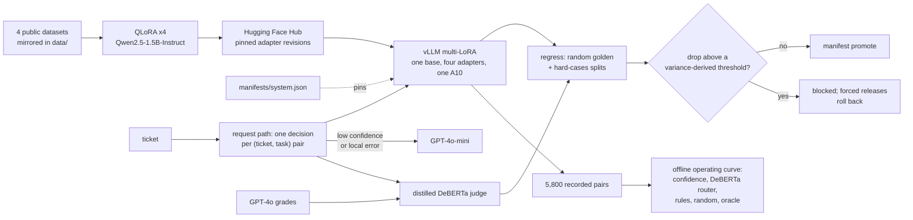

# AdapterOps


[](https://huggingface.co/spaces/Tanny03/adapterops-demo)

AdapterOps is a multi-task LoRA adapter service for customer-support tickets. Four task-specific
adapters — intent classification, urgency, PII detection and reply drafting — share one
Qwen2.5-1.5B base model and are served together from a single GPU with vLLM, instead of running a
separate model or frontier-API call per task.

It was built to answer the questions that decide whether a small fine-tuned model is worth running:
does fine-tuning beat prompting the same model, when should a request escalate to a frontier API, and
has a new release regressed before it ships? So the service comes with its evaluation: frozen golden
sets, a regression gate whose thresholds are derived from measured run-to-run variance, a versioned
manifest with a proven rollback, a routing study against GPT-4o-mini, and a distilled judge for the one
open-ended task. Results — including the negative ones — are in [`STATUS.md`](STATUS.md) and
[`runs/DASHBOARD.md`](runs/DASHBOARD.md). Portfolio project: no real users or customer data.

[](https://huggingface.co/spaces/Tanny03/adapterops-demo)

## Architecture

What was built and run. The routing policies were compared offline on recorded pairs; the request
path routes live, but has not served a representative load (see Limitations).



`manifests/system.json` pins the base model, adapter revisions, router, judge and every eval split
by sha256, and serving reads it. Promoting a candidate whose regression exceeds its threshold is
refused, and moving the router or judge needs that component's own evaluation report.

The request path (`adapterops serve-api`) splits a ticket into one pair per task and answers each
with its adapter. A pair escalates to GPT-4o-mini when the adapter's mean log-probability is below
the committed 20% operating point, or falls back to it when local output is unusable, and the two
are counted apart. The distilled judge scores locally answered drafts. Live frontier-call rate,
fallback rate, P95 latency and cost per 1K are served at `/v1/metrics`, and traces go to a local
file or Langfuse.

## Results

Every number is rendered from a committed run in [`runs/DASHBOARD.md`](runs/DASHBOARD.md).

| Question | Answer |
|---|---|
| Does fine-tuning beat prompting the same base? | On three of four tasks, on one vLLM server: intent 0.929 vs 0.573 accuracy (77 classes), PII span F1 0.946 vs 0.570, drafting 4.24 vs 2.86 (GPT-4o-graded). Urgency's 0.410 vs 0.396 macro-F1 is inside its own run-to-run spread, and TF-IDF beats both (0.55). |
| Can four adapters share one GPU? | 5,800 requests at concurrency 16 on one A10, 0 errors, 23.6 req/s. |
| When should a request escalate to GPT-4o-mini? | On the adapter's own confidence: 57% of the oracle's gain at 20% escalation. The learned DeBERTa router scores −19% — worse than never escalating — and three pre-registered fixes also lost. |
| Does the offline routing hold on the live request path? | On the curve's own pairs, yes: through vLLM on the A10 at concurrency 1–32, 20.2–21.4% of pairs went to GPT-4o-mini against the curve's 19.9%, with the curve's decision on 96–97% of pairs, 1 fallback in 392 and 23.9 pairs/s at concurrency 32. A full regression run took 75 s. |
| Is local serving cheaper than GPT-4o-mini? | Only above 3.64 requests per second sustained ($0.0088 vs $0.0572 per 1K at an assumed $0.75/h A10). |
| Does the gate catch a bad release? | A shuffled-label intent adapter dropped accuracy by 0.923 against a 0.0117 threshold: blocked, forced with the override recorded, rolled back. |
| Does a failure-mined hard split make the gate more sensitive? | No. Mined from the incumbent's own failures, it scores under-trained checkpoints *higher* on three of four tasks. |
| Does int8 cost accuracy? | Not in the weights: intent with int8 weights scores 0.9325 against fp32's 0.9312. PyTorch's dynamic int8, which also quantizes activations to 8 bits, falls to 0.62–0.66. Measured on a laptop CPU, not in serving. |


## Limitations

- **The request path has been load-tested in bursts, on recorded pairs.** On the A10 the curve's 392
  pairs at concurrency 1–32 escalated 20.2–21.4% (the curve: 19.9%) at up to 23.9 pairs/s, but the
  longest pass lasted under six minutes, and the pairs are the curve's own in-distribution eval split —
  not new traffic, and not the shifted population.
- **Regression checks are on-demand.** They need GPU inference, and GitHub Actions free runners are
  CPU-only, so runs happen in a rented GPU session and their results are committed. CI runs the tests
  on every push and checks the adapter pins weekly; there is no unattended regression run.
- **The PII adapter invents spans on text with no personal data** — `AGE: 3, SEX: M` for a ticket
  about a late card. Every training and golden document contained PII, so its 0.946 span F1 is
  conditional on the input having some.
- **PRD §7's 500 ms P95 is missed for PII (2,259 ms) and drafting (3,000 ms)**, the two tasks that
  generate long outputs; intent (136 ms) and urgency (60 ms) meet it. The router's decision is
  inside its 50 ms budget on CPU (P95 24.9 ms per pair).
- **Only intent's gate is enforced.** The other tasks' thresholds are provisional until their
  training variance is measured.
- **The distilled judge only tracks GPT-4o on adapter-like replies** (Spearman 0.74), not on another
  generator's (0.33).
- **The public demo shows recorded outputs.** The live Gradio app runs locally (`demo/app.py`).

## Setup & Usage

### Prerequisites

- **Python 3.12+** and **[uv](https://docs.astral.sh/uv/)** — dependencies are locked in `uv.lock`.
- **macOS or Linux** for evaluation, routing, the judge, the dashboard and the demo; all run on CPU.
- **Linux with an NVIDIA GPU (CUDA)** only for training adapters and serving with vLLM. The adapters
  were trained on free Colab/Kaggle T4s and a rented A10.
- **`OPENAI_API_KEY`** (optional) — only for commands that call GPT-4o-mini or GPT-4o: `frontier`,
  `judge-label`, `judge-m2` and `python -m adapterops.eval.ceiling`.
- **A Hugging Face login** (optional) — only to push adapters, model cards or the demo Space.

### Installation

```bash
git clone https://github.com/tpawar03/AdapterOps.git
cd AdapterOps
uv sync
```

On the GPU machine, add vLLM and bitsandbytes:

```bash
uv sync --extra gpu
```

For the API-calling commands, put the key in a `.env` file at the repository root:

```bash
echo "OPENAI_API_KEY=your-key" > .env
```

### Usage Guide

Everything runs through one CLI; `uv run adapterops --help` lists every command.

Inspect the system — CPU only, no API key:

```bash
uv run adapterops manifest show     # served adapter revisions, frozen eval splits, gate state
uv run adapterops verify-pins       # has any pinned adapter moved on the Hugging Face Hub?
uv run adapterops economics         # cost per 1K requests and weight footprint -> runs/economics.json
uv run adapterops router-plot       # operating-curve chart -> runs/router__operating_curve__judged.png
uv run adapterops router-latency    # router decision latency on CPU -> runs/router__latency.json
uv run adapterops router-misroutes  # misrouted decisions at the operating point -> evals/misroutes/
uv run adapterops quantize-compare  # fp32 vs dynamic int8 on the intent adapter -> runs/intent__int8.json
uv run adapterops serve-api --backend transformers --no-frontier   # the request path on this machine
uv run adapterops dashboard         # six-metric results dashboard -> runs/DASHBOARD.md
```

Run the demo:

```bash
uv run python demo/app.py           # live Gradio app; downloads the pinned base model and adapters
uv run python demo/build_static.py  # recorded demo page -> demo/_static/ (--push publishes it)
```

Train, serve and gate a release — on the GPU machine:

```bash
uv run adapterops train --task intent --hub-repo <user>/adapterops-intent
bash scripts/phase2_serve.sh        # vLLM: the base model plus all four pinned adapters
uv run adapterops serve-api --backend vllm --base-url http://localhost:8000  # routed request path
uv run adapterops request-path-run --name a10 --concurrency 1 4 16  # the curve's 392 pairs, live
bash scripts/gpu_request_path_session.sh   # all of the above plus one regression run, one session
bash scripts/gpu_load_session.sh           # shifted population live, saturation sweep, 15 min sustained
uv run adapterops regress --base-url http://localhost:8000 --name candidate \
    --baseline runs/regression__v1-baseline-1.json
uv run adapterops manifest promote --note "what changed" --regression runs/regression__candidate.json
uv run adapterops manifest rollback --to 2
```

`manifest promote` refuses a candidate whose drop on any enforced task exceeds its gate threshold;
`manifest rollback` restores an earlier manifest version. See the comments in
`scripts/phase2_serve.sh` for setting up the serving environment.

### Running Tests

```bash
uv run pytest                       # full suite, CPU only, no API key or network
uv run ruff check src tests demo    # lint
```

One test reproduces the distilled judge's calibration scores and needs the locally trained judge in
`checkpoints/`, which is not in git; it skips when the checkpoint is absent.

## Tech Stack

| Layer | Technologies |
|---|---|
| Language and tooling | Python 3.12, uv, pytest, Ruff |
| Base model and fine-tuning | Qwen2.5-1.5B-Instruct · QLoRA (4-bit NF4) with Hugging Face Transformers, PEFT, bitsandbytes and Accelerate |
| Serving | vLLM with multi-LoRA — four adapters on one base model, one GPU |
| Router and judge | DeBERTa-v3 (small for the router, base for the judge) · scikit-learn baselines |
| Frontier models | OpenAI API — GPT-4o-mini as the escalation target, GPT-4o for judge labels |
| Data | pandas and Parquet, Hugging Face Datasets, spaCy for the PII baseline |
| Registry and hosting | Hugging Face Hub — pinned adapter revisions, model cards and a static Space |
| Demo | Gradio for the live app · static HTML and JavaScript for the public page |
| Compute | Colab and Kaggle T4 GPUs for training · a rented A10 for training and serving |

**Data licences:** Banking77 via `mteb/banking77` (MIT) · `Tobi-Bueck/customer-support-tickets` by Tobi Bueck (CC BY-NC 4.0 — the urgency adapter is non-commercial) · `ai4privacy/pii-masking-openpii-1m` (CC BY 4.0) · `bitext/Bitext-customer-support-llm-chatbot-training-dataset` (CDLA-Sharing-1.0); sources in `data/MANIFEST.json`.
