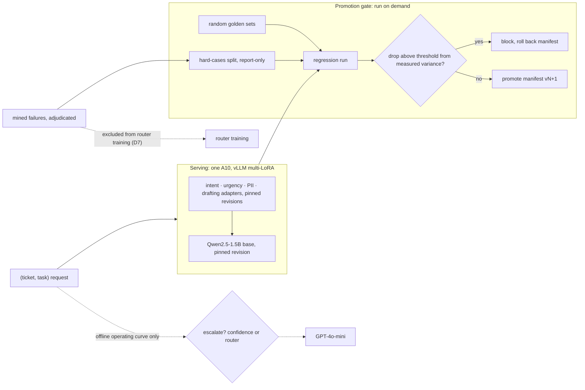

# AdapterOps

Four LoRA adapters over one Qwen2.5-1.5B base model, served together on a single A10 with vLLM,
and a regression gate proven by breaking an adapter on purpose: the break was detected, promotion
was blocked, and the manifest was rolled back.

The evaluation is the project. Two eval splits kept apart, gate thresholds derived from measured
run-to-run variance, and a free baseline chosen because it might beat the learned router — which
it did. The negative results are below with the same care as the wins.

Portfolio project. No real users, no real customer data. About $10.50 spent of a $50 ceiling.

- **Results:** [`runs/DASHBOARD.md`](runs/DASHBOARD.md) — rendered from committed runs, no number typed by hand
- **Demo:** built in [`demo/`](demo/), not yet deployed — `uv run python demo/app.py` runs it locally
- **Decisions and findings:** [`STATUS.md`](STATUS.md) · **Spec:** [`adapter-service-prd.md`](adapter-service-prd.md) (v2.6)

## What was shown

| Claim | Result | Evidence |
|---|---|---|
| Four adapters served at once on one base | **5,800 requests, 0 errors**, 23.6 req/s on one A10 at concurrency 16. P95: urgency 60 ms, intent 136 ms, PII 2.3 s, drafting 3.0 s | `runs/m1_serving.json` |
| Fine-tuning beats prompting the same base, same server — **on three of four tasks** | intent **0.929 vs 0.573** micro-accuracy · PII **0.946 vs 0.57** strict span F1 · drafting **4.24 vs 2.86** of 5, **graded by GPT-4o** · urgency: no (below) | `runs/*prompted*`, `runs/drafting__m2_gpt4o.json` |
| Adapters vs GPT-4o-mini on the same golden sets | intent **0.929 vs 0.687** · PII **0.946 vs 0.666** · urgency 0.410 vs 0.382 macro-F1 · drafting **4.24 vs 4.52**, GPT-4o-graded — GPT-4o-mini leads on the open-ended task, and GPT-4o grades both sides | `runs/frontier__golden.json`, `runs/drafting__m2_gpt4o__frontier.json` |
| Detect → block → roll back, on real serving | shuffled-label intent adapter: accuracy drop **0.923** against an enforced **0.0117** threshold → promotion refused → forced as v3 with the override recorded → rolled back to v2 | `runs/regression__intent-shuffled.json`, `manifests/history/` |
| Gate thresholds come from measured noise | two runs of an unchanged manifest; a threshold is 3× the larger of inference and training spread. Intent's is enforced; the others are provisional because their training variance was never measured | `evals/GATE_THRESHOLDS.json` |
| Label noise in failure-mined eval data | **24%** of intent's mined hard cases (18 of 75) quarantined as disputed labels | `STATUS.md` D36 |
| One base instead of a model per task | **3.38 GB** of weights on disk (base + four 73.9 MB adapters) vs **12.35 GB** for a full copy per task. Disk only — GPU memory was not measured | `runs/economics.json` |

## What did not work

Each of these outcomes was named as reportable in the spec before it was known.

1. **The urgency adapter does not beat simpler methods.** It scores 0.41 macro-F1 against 0.55 for
   TF-IDF + logistic regression, and its margin over a prompted base model (+0.013) is the size of
   its own run-to-run spread (0.0127). Format failure, label noise and unlearnability were each
   ruled out; the text-to-priority signal in this data is weak. The adapter ships, labelled.
2. **The learned router lost to a free baseline.** At a 20% escalation budget, routing on the
   adapter's own confidence captures **57%** of the available quality gain (43% under distribution
   shift). The DeBERTa router scores **−19%** (−31%) — worse than never escalating — and under
   judge labels its ranking AUC equals a lookup on the task name (0.691 vs 0.691). Three
   pre-registered fixes — training on "escalation helps" instead of "adapter fails", a logistic
   cascade over the adapter's log-probabilities, and per-task confidence — all lost too, with 95%
   bootstrap intervals below zero (D42, `runs/router__v2.json`). The best of them ranked the
   helpful escalations well (AUC 0.82) and still captured 14% of the gain, because its label
   could not see the pairs escalation breaks. A two-line rule — escalate tasks in the order
   escalation helped them in training, longest ticket first — captured 38%: better than every
   learned router, still below confidence (F26, `runs/router__rules.json`).
3. **Escalating everything to GPT-4o-mini lowers quality here.** On its own it scores 0.52 on the
   router pool against 0.73 for the local adapters. Escalation pays only when it is selective.
4. **The hard-cases split cannot catch a regression.** It was mined from the current adapter's own
   failures, so that adapter scores 0.0 on intent's hard cases by construction, and under-trained
   checkpoints scored *higher* on it for three of four tasks. The random golden set flagged all
   four. A split mined from one model's failures measures difference from that model, not
   difficulty, so it stays report-only.
5. **The distilled judge fails out of distribution.** It tracks GPT-4o at Spearman 0.73 on held-out
   adapter replies but 0.33 on another generator's, and it does not see truncation: it ranked
   prompted drafting — 72% of replies cut off mid-sentence — above the adapter (4.70 vs 4.27).
   GPT-4o reversed that (2.86 vs 4.24), which is why drafting's headline number is GPT-4o-graded.

## Architecture



The router is evaluated offline on an operating curve; it does not sit in the serving path.
Serving resolves adapters through a pin file at exact Hub revisions, never through `main` —
a stale clone once overwrote a published adapter, and the recorded score then described weights
nobody was serving.

## Evaluation design — the decisions that carry it

Full reasoning, with each rejected alternative, is in [`STATUS.md`](STATUS.md) §2.

- **Two splits, never blended** (D6, F32). An average can improve while the cases that matter get
  worse; one number cannot show that.
- **The leak caught before code** (D7). Failure records were designed to feed both router training
  and the hard-cases split, so the router would have trained on its own eval items.
- **Label noise screened** (D8, D36). Items a model gets wrong are enriched for wrong gold labels;
  those are quarantined rather than gated on.
- **Thresholds from measured variance** (D9, D37). No threshold is set on a split whose measured
  floor is zero — it would block every release that moves at all.
- **The metric fits the dataset's shape** (D10). Banking77 has 77 classes, so intent's golden set
  is 770 on micro-accuracy; 300 examples would be under four per class.
- **A confounded shift test replaced** (D11). Task identity was collinear with data source, so the
  original test measured an unseen task, not distribution shift.

## Cost — derived, not billed

| | |
|---|---|
| GPT-4o-mini on the same 5,800 pairs, list price | $0.0572 per 1K |
| local A10 at M1's 23.6 req/s, $0.75/h assumed | $0.0088 per 1K |
| **break-even sustained load** | **3.64 req/s** (13,112 requests/hour) |

Local serving is cheaper only while load stays above the break-even rate: a rented GPU bills by the
hour whether or not requests arrive. The 6.5× ratio between the two per-1K figures holds only for
a GPU that is never idle. Not measured, so not claimed: GPU memory at serving, frontier latency,
and the A10's maximum throughput — M1 was a 246-second burst, not a saturation test.

Judging costs **$1.30 per 1,000** GPT-4o grades (token-derived, 2,800 grades) against **59 seconds
per 1,000** for the distilled judge on a laptop CPU with no API bill (`runs/judge__cost.json`). At
this project's volume every GPT-4o grade together cost under $4, so distillation did not pay for
itself here (D13).

## Limitations

- **The manifest does not fully drive serving (M6, partial).** Serving materialises the pin files
  the manifest is built from; it does not read `manifests/system.json` itself.
- **No unattended monitoring** (D4). Free CI runners have no GPU, so regression runs happen during a
  rented session, on demand.
- **No live router.** The frontier-call rate on the dashboard is the offline operating curve, and
  fallback rate was recorded once, on M1.
- **Only intent's gate is enforced.** The other thresholds rest on inference spread alone and stay
  provisional until training variance is measured for those tasks.
- **Drafting's gate uses the distilled judge**, which is sound adapter-vs-adapter near its training
  distribution and unsound across generators.
- **The urgency adapter is non-commercial** — see licences below.

## Reproduce

```bash
uv sync                          # base — macOS and Linux
uv run pytest                    # 190+ tests, CPU only
uv run adapterops economics      # derived cost + footprint -> runs/economics.json
uv run adapterops dashboard      # six-metric dashboard -> runs/DASHBOARD.md
uv run python demo/app.py        # Gradio demo; downloads the pinned base + adapters on first run
```

GPU work ran on a rented A10 (`uv sync --extra gpu` adds vLLM and bitsandbytes). The exact session
scripts are [`PHASE-2-RUN.md`](PHASE-2-RUN.md) and [`PHASE-4-RUN.md`](PHASE-4-RUN.md); Gate 0.5 is
[`GATE-0.5.md`](GATE-0.5.md). Training ran on free Colab/Kaggle T4s and a rented A10. Latency from a
shared free tier is not reported anywhere.

## The documents

| File | What it is |
|---|---|
| [`adapter-service-prd.md`](adapter-service-prd.md) | The spec — v2.6. What gets built and why, with `§`/`F`/`M` identifiers everything else references. |
| [`BUILD-PLAN.md`](BUILD-PLAN.md) | Execution order, per-phase task lists, and the points to stop and reassess. |
| [`STATUS.md`](STATUS.md) | Status, decision log with rejected alternatives, trade-offs, and every finding. |
| [`COST-LOG.md`](COST-LOG.md) | Every charge against the $50 ceiling. |
| [`runs/DASHBOARD.md`](runs/DASHBOARD.md) | The six-metric results dashboard and the failure demo. |

## Layout

```
src/adapterops/     train · eval · router · judge · serve · manifest
evals/golden/       random held-out splits (intent 770, others 300)
evals/hard/         failure-mined, adjudicated split (report-only)
manifests/          pinned adapters, system manifest, version history, candidates
runs/               committed run results and DASHBOARD.md
data/               mirrored dataset snapshots (PRD §9)
notebooks/          Colab training notebooks
demo/               Gradio app and Space bundler
```

## Data sources and licences

| task | source | licence | notes |
|---|---|---|---|
| intent | `mteb/banking77` | MIT | parquet mirror of Banking77 |
| urgency | `Tobi-Bueck/customer-support-tickets` | **CC BY-NC 4.0** | **non-commercial** — see below |
| pii | `ai4privacy/pii-masking-openpii-1m` | CC BY 4.0 | synthetic spans, English rows only |
| drafting | `bitext/Bitext-customer-support-llm-chatbot-training-dataset` | CDLA-Sharing-1.0 | share-alike; attribution required |

### Non-commercial restriction on the urgency adapter

The urgency data is licensed **CC BY-NC 4.0**. The adapter trained on it
(`Tanny03/adapterops-urgency`) is a derivative work and inherits that restriction:

- **Not for commercial use.** Demonstration, evaluation and portfolio use only.
- **Attribution required** — dataset by Tobi Bueck, `Tobi-Bueck/customer-support-tickets`.

This is the only non-permissive source in the project. The other three adapters carry no
such restriction.

It was a deliberate trade. PRD §9 originally named a CC0 Kaggle dataset
(`albertobircoci/support-ticket-priority-dataset-50k`), which turned out to contain **no
ticket text at all** — it is tabular, and its `description_length` column is an integer
with the description itself absent. The choice was therefore an NC-licensed source that
works, or no urgency adapter. See PRD changelog 27.
