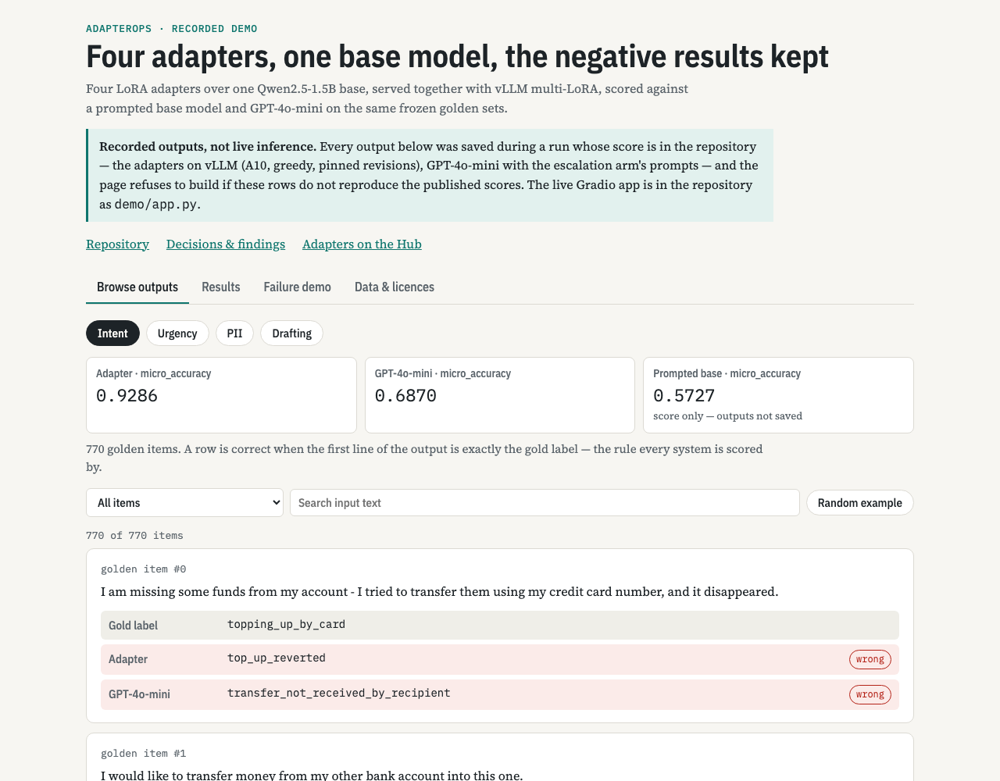
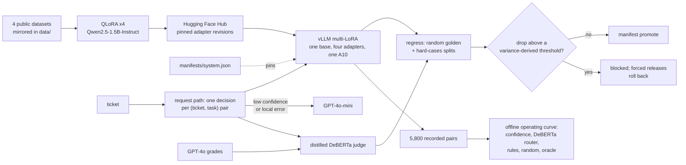
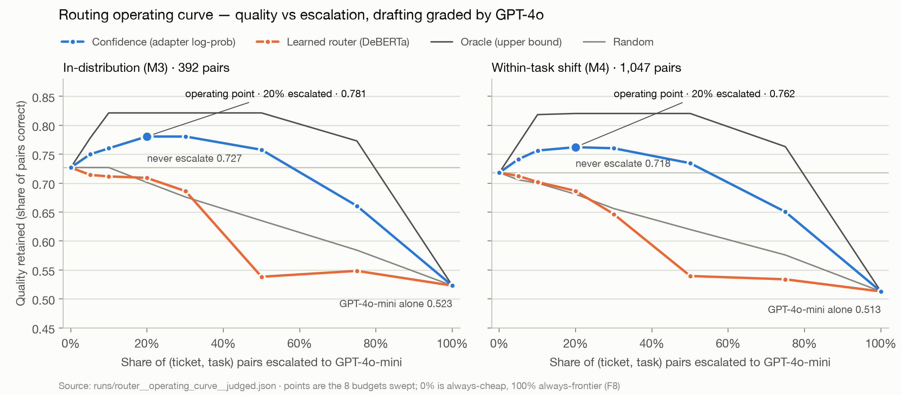

# AdapterOps


[](https://huggingface.co/spaces/Tanny03/adapterops-demo)

AdapterOps is a multi-task LoRA adapter service for customer-support tickets. Four task-specific
adapters — intent classification, urgency, PII detection and reply drafting — share one
Qwen2.5-1.5B base model and are served together from a single GPU with vLLM, instead of running a
separate model or frontier-API call per task. Urgency is the exception since manifest v8: a TF-IDF
classifier beat its adapter on every split and across three training seeds, so it is served behind
the same interface instead, pinned by file sha256 like the router and judge.

It was built to answer the questions that decide whether a small fine-tuned model is worth running:
does fine-tuning beat prompting the same model, when should a request escalate to a frontier API, and
has a new release regressed before it ships? So the service comes with its evaluation: frozen golden
sets, a regression gate whose thresholds are derived from measured run-to-run variance, a versioned
manifest with a proven rollback, a routing study against GPT-4o-mini, and a distilled judge for the one
open-ended task. Results — including the negative ones — are in [`STATUS.md`](STATUS.md) and
[`runs/DASHBOARD.md`](runs/DASHBOARD.md). Portfolio project: no real users or customer data.

[](https://huggingface.co/spaces/Tanny03/adapterops-demo)

## Architecture

What was built and run. The routing policies were compared offline on recorded pairs; the request
path routes live, but has not served a representative load (see Limitations).



`manifests/system.json` pins the base model, adapter revisions, router, judge and every eval split
by sha256, and serving reads it. Promoting a candidate whose regression exceeds its threshold is
refused, and moving the router or judge needs that component's own evaluation report.

The request path (`adapterops serve-api`) splits a ticket into one pair per task and answers each
with its adapter. A pair escalates to GPT-4o-mini when the adapter's mean log-probability is below
the committed 20% operating point, or falls back to it when local output is unusable, and the two
are counted apart. The distilled judge scores locally answered drafts. Live frontier-call rate,
fallback rate, P95 latency and cost per 1K are served at `/v1/metrics`, and traces go to a local
file or Langfuse.

## Results

Every number comes from a committed run: most are rendered in [`runs/DASHBOARD.md`](runs/DASHBOARD.md), and the
realistic-format PII and rebuilt hard-split rows come from `runs/pii__realistic.json`,
`runs/pii__realistic__realistic.json`, `runs/pii__realistic__compare__realistic.json` and
`runs/hard__shared.json`.

| Question | Answer |
|---|---|
| Does fine-tuning beat prompting the same base? | On three of four tasks, on one vLLM server: intent 0.929 vs 0.573 accuracy (77 classes), PII span F1 0.946 vs 0.570 (on its own synthetic test set — see the next rows), drafting 4.24 vs 2.86 (GPT-4o-graded). Urgency's 0.410 vs 0.396 macro-F1 is inside its own run-to-run spread, and TF-IDF beats both (0.540 against 0.421 in one session; 4.1 standard deviations above the adapter's three-seed mean). Since manifest v8, urgency is served by TF-IDF behind the same interface, at about 4 ms a request with no GPU. |
| Does PII masking hold on text unlike its training data? | Not at first, and retraining fixed most of it. Manifest v6's adapter left 28.3% of the spans it covers wholly unmasked on 200 Nemotron-PII texts in realistic US and international formats, and 14.3% on 200 real court-judgment paragraphs (TAB), against 0.79% on its golden set. Retrained with Nemotron-PII documents added and promoted as manifest v7, it leaves **3.99%** and **8.32%** (TAB change −0.060, 95% CI −0.0897 to −0.0323), with golden span F1 unchanged in the same session (0.9421) — the rule for that swap was frozen before training. What it masks is almost always personal data (99.0%, 94.0%). It still misses confidently: confidence routing escalates none of the 148 texts that leak. |
| Can four adapters share one GPU? | 5,800 requests at concurrency 16 on one A10, 0 errors, 23.6 req/s. The A10's ceiling is ~104 req/s at concurrency 256 (P95 7.8 s), and 15 minutes at concurrency 32 held 43 req/s with no errors. |
| When should a request escalate to GPT-4o-mini? | On the adapter's own confidence: 57% of the oracle's gain at 20% escalation. The learned DeBERTa router scores −19% — worse than never escalating — and three pre-registered fixes also lost. |
| Does the offline routing hold on the live request path? | On the curve's own pairs, yes: through vLLM on the A10, 20–21% of pairs escalated against the curve's 19.9% at every concurrency up to 256 and in every minute of a 15-minute sustained run, and the shifted population escalated 18.4% against 19.3% recorded. Its throughput matches vLLM's own within 1.5% at every concurrency. A full regression run took 75 s. |
| Is local serving cheaper than GPT-4o-mini? | Only above 3.64 requests per second sustained, at an assumed $0.75/h A10. At measured throughput a local 1K requests costs $0.0048 at 43 req/s (P95 2.4 s) and $0.0020 at the ~103 req/s ceiling (P95 7.8 s), against GPT-4o-mini's $0.0572. |
| Does the gate catch a bad release? | A shuffled-label intent adapter dropped accuracy by 0.923 against a 0.0117 threshold: blocked, forced with the override recorded, rolled back. All four gates are enforced from retraining variance measured across three seeds (intent 0.0117, urgency 0.1224, PII 0.0069, drafting 0.0903). Three under-trained checkpoints fall outside theirs; urgency's (drop 0.087) sits inside its widened gate and is blocked only by the separate check that a release still beats the prompted base model (0.322 against 0.396). |
| Does a failure-mined hard split make the gate more sensitive? | Only when mined from other models' failures. Mined from the incumbent's own failures, it scored under-trained checkpoints *higher* on three of four tasks. Rebuilt from 540 golden items that GPT-4o-mini (and, for PII, the retrained PII adapter) gets wrong — no model the check compares — it flags the under-trained checkpoints on all four tasks, with drops of 0.11–0.27. Intent, urgency and drafting still rest on that one outside model. |
| Does int8 cost accuracy? | Not in the weights: intent with int8 weights scores 0.9325 against fp32's 0.9312. PyTorch's dynamic int8, which also quantizes activations to 8 bits, falls to 0.62–0.66. Measured on a laptop CPU, not in serving. |



## Limitations

Each limitation below, and the others recorded in `STATUS.md`, is queued as work in [`TODO.md`](TODO.md).

- **Most of the system does not generalise beyond its training datasets, measured.** On 300 tickets from two
  sources no model trained on (`runs/ood.json`): intent is right on 63% and 26% of tickets where a Banking77 label
  even fits (93% in-domain) and invents labels outside the 77 on 12–23%; confidence routing escalates none of
  its wrong answers; urgency's macro F1 falls to 0.19–0.29; and the distilled judge scores replies 4.3–4.5 where
  GPT-4o gives 2.9–3.2, with negative rank correlation, so drafting's gate cannot see a bad reply out of domain.
  PII holds up best: 0.6% of spans wholly unmasked on shop conversations, though it over-flags redacted text. Each adapter learned one
  public dataset's task and domain — banking queries with 77 fixed intent labels, IT support tickets,
  synthetic personal-data documents, templated retail replies — and every score is on held-out data from the
  same dataset. The router's threshold was calibrated on those tasks, and its shift test varies wording and
  length within them, not the domain. No real traffic has been run.
- **The request path has been load-tested on recorded pairs, not new traffic.** On the A10 it matched
  vLLM's own throughput up to ~103 pairs/s and held 43 pairs/s for 15 minutes; with GPT-4o-mini answering
  its escalations it held 32 pairs/s for 5 minutes with no frontier errors — but at 387 calls a minute the
  OpenAI account's 10,000-requests-a-day cap would last about 26 minutes.
- **Regression checks are on-demand.** They need GPU inference, and GitHub Actions free runners are
  CPU-only, so runs happen in a rented GPU session and their results are committed. CI runs the tests
  on every push and checks the adapter pins weekly; there is no unattended regression run.
- **PII's false positives were fixed by retraining, and one number still describes the old adapter.** The
  original PII adapter reported personal data in all 928 PII-free test texts — invented values such as
  `GIVENNAME: John` in 87% — because no training document was free of PII. Retrained with PII-free sentences
  and empty answers, manifest v6's adapter flagged 5 of those 928 and none of 491 held-out
  sentences. The adapter served since manifest v7, retrained on realistic formats as well, flags 4 and 4 —
  a small regression on the held-out sentences — with golden span F1 unchanged in-session (0.9421).
  Strictly, it gets every span right in 72% of golden documents, but masks all their personal text in 87%: most errors are confusable ID-number or
  gender/sex labels and names split differently — which the dataset's own text cannot decide, so runs also
  report a grouped span F1 (0.986) — and 1.1% of gold spans are left wholly unmasked. The router's PII decisions were
  re-checked with manifest v6's adapter and did not change; PII's training spread was measured on the previous adapter.
- **PRD §7's 500 ms P95 is missed for PII (2,259 ms) and drafting (3,000 ms)**, the two tasks that
  generate long outputs; intent (136 ms) and urgency (60 ms) meet it. The router's decision is
  inside its 50 ms budget on CPU (P95 24.9 ms per pair).
- **Urgency's gate is too wide to mean much.** Gates now rest on three seeds per task, and the earlier
  same-seed reruns understated retraining variance: urgency's adapter moves 0.041 between seeds, against
  0.006 at one seed, so its threshold widened from 0.0381 to 0.1224 — wider than its whole margin over the
  prompted base (0.0134). An under-trained urgency checkpoint passes the variance gate and is caught only by
  the prompted-baseline check. TF-IDF beats every urgency adapter seed (0.540 against at best 0.458),
  which is why manifest v8 serves urgency from TF-IDF; the adapter's gate now guards nothing served.
- **The distilled judge only tracks GPT-4o on adapter-like replies** (Spearman 0.74), not on another
  generator's (0.33).
- **The public demo shows recorded outputs.** The live Gradio app runs locally (`demo/app.py`).

## Setup & Usage

### Prerequisites

- **Python 3.12+** and **[uv](https://docs.astral.sh/uv/)** — dependencies are locked in `uv.lock`.
- **macOS or Linux** for evaluation, routing, the judge, the dashboard and the demo; all run on CPU.
- **Linux with an NVIDIA GPU (CUDA)** only for training adapters and serving with vLLM. The adapters
  were trained on free Colab/Kaggle T4s and a rented A10.
- **`OPENAI_API_KEY`** (optional) — only for commands that call GPT-4o-mini or GPT-4o: `frontier`,
  `judge-label`, `judge-m2` and `python -m adapterops.eval.ceiling`.
- **A Hugging Face login** (optional) — only to push adapters, model cards or the demo Space.

### Installation

```bash
git clone https://github.com/tpawar03/AdapterOps.git
cd AdapterOps
uv sync
```

On the GPU machine, add vLLM and bitsandbytes:

```bash
uv sync --extra gpu
```

For the API-calling commands, put the key in a `.env` file at the repository root:

```bash
echo "OPENAI_API_KEY=your-key" > .env
```

### Usage Guide

Everything runs through one CLI; `uv run adapterops --help` lists every command.

Inspect the system — CPU only, no API key:

```bash
uv run adapterops manifest show     # served adapter revisions, frozen eval splits, gate state
uv run adapterops verify-pins       # has any pinned adapter moved on the Hugging Face Hub?
uv run adapterops economics         # cost per 1K requests and weight footprint -> runs/economics.json
uv run adapterops router-plot       # operating-curve chart -> runs/router__operating_curve__judged.png
uv run adapterops router-latency    # router decision latency on CPU -> runs/router__latency.json
uv run adapterops router-misroutes  # misrouted decisions at the operating point -> evals/misroutes/
uv run adapterops quantize-compare  # fp32 vs dynamic int8 on the intent adapter -> runs/intent__int8.json
uv run adapterops serve-api --backend transformers --no-frontier   # the request path on this machine
uv run adapterops dashboard         # six-metric results dashboard -> runs/DASHBOARD.md
```

Run the demo:

```bash
uv run python demo/app.py           # live Gradio app; downloads the pinned base model and adapters
uv run python demo/build_static.py  # recorded demo page -> demo/_static/ (--push publishes it)
```

Train, serve and gate a release — on the GPU machine:

```bash
uv run adapterops train --task intent --hub-repo <user>/adapterops-intent
bash scripts/phase2_serve.sh        # vLLM: the base model plus all four pinned adapters
uv run adapterops serve-api --backend vllm --base-url http://localhost:8000  # routed request path
uv run adapterops request-path-run --name a10 --concurrency 1 4 16  # the curve's 392 pairs, live
bash scripts/gpu_request_path_session.sh   # all of the above plus one regression run, one session
bash scripts/gpu_load_session.sh           # shifted population live, saturation sweep, 15 min sustained
bash scripts/gpu_training_variance_session.sh  # retrain urgency/PII/drafting for gate floors; GPT-4o-mini under load
bash scripts/gpu_pii_negatives_session.sh      # retrain PII with PII-free sentences; score it beside the served one
uv run adapterops regress --base-url http://localhost:8000 --name candidate \
    --baseline runs/regression__v1-baseline-1.json
uv run adapterops manifest promote --note "what changed" --regression runs/regression__candidate.json
uv run adapterops manifest rollback --to 2
```

`manifest promote` refuses a candidate whose drop on any enforced task exceeds its gate threshold;
`manifest rollback` restores an earlier manifest version. See the comments in
`scripts/phase2_serve.sh` for setting up the serving environment.

### Running Tests

```bash
uv run pytest                       # full suite, CPU only, no API key or network
uv run ruff check src tests demo    # lint
```

One test reproduces the distilled judge's calibration scores and needs the locally trained judge in
`checkpoints/`, which is not in git; it skips when the checkpoint is absent.

## Tech Stack

| Layer | Technologies |
|---|---|
| Language and tooling | Python 3.12, uv, pytest, Ruff |
| Base model and fine-tuning | Qwen2.5-1.5B-Instruct · QLoRA (4-bit NF4) with Hugging Face Transformers, PEFT, bitsandbytes and Accelerate |
| Serving | vLLM with multi-LoRA — four adapters on one base model, one GPU |
| Router and judge | DeBERTa-v3 (small for the router, base for the judge) · scikit-learn baselines |
| Frontier models | OpenAI API — GPT-4o-mini as the escalation target, GPT-4o for judge labels |
| Data | pandas and Parquet, Hugging Face Datasets, spaCy for the PII baseline |
| Registry and hosting | Hugging Face Hub — pinned adapter revisions, model cards and a static Space |
| Demo | Gradio for the live app · static HTML and JavaScript for the public page |
| Compute | Colab and Kaggle T4 GPUs for training · a rented A10 for training and serving |

**Data licences:** Banking77 via `mteb/banking77` (MIT) · `Tobi-Bueck/customer-support-tickets` by Tobi Bueck (CC BY-NC 4.0 — the urgency adapter is non-commercial) · `ai4privacy/pii-masking-openpii-1m` (CC BY 4.0) · `bitext/Bitext-customer-support-llm-chatbot-training-dataset` (CDLA-Sharing-1.0); sources in `data/MANIFEST.json`. Evaluation only, with sampled texts in `runs/pii__realistic__predictions.parquet`: `nvidia/Nemotron-PII` by NVIDIA (CC BY 4.0) · the Text Anonymization Benchmark by Norsk Regnesentral (MIT).
