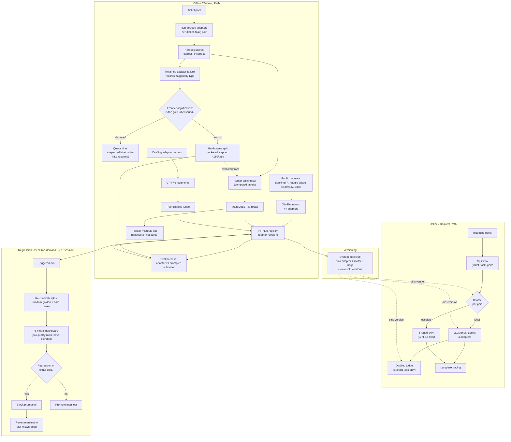

# PRD: Multi-Task Adapter Service with Cost-Aware Routing and Calibrated Evaluation

**Version:** 2.3 (two-split evaluation with measured gate sensitivity)
**Owner:** Solo build
**Status:** Ready to start
**Estimated duration:** 9 weeks at 20 hrs/week (~180 hours)

---

## Changelog

Two rounds of substantive revision, each triggered by the previous version claiming something it could not deliver. Nine changes fixed the original scope and infrastructure assumptions; nine more fixed the hard-cases split introduced in v2.1, which as written leaked into router training, gated on label noise, and had no evidence that it caught anything. A final entry records a renumbering that changed nothing — logged rather than applied quietly, for the reason given in the row itself.

### v1 → v2 — scope and infrastructure

| # | Change | Reason |
|---|---|---|
| 1 | **6 adapters → 4** (intent, urgency, PII, drafting). Sentiment and topic cut. | Adapters 5 and 6 were the same code with a different CSV. No headline claim depends on 6 vs. 4. Sentiment had the weakest data story. Saves ~1.5 weeks. |
| 2 | **Router operates on (ticket, task) pairs**, not tickets | With multiple adapters per ticket, a per-ticket success label is ill-defined when adapter A succeeds and adapter B fails. |
| 3 | **Confidence-based routing added as a P0 baseline** | The adapter's own softmax confidence is nearly free and is the strongest realistic alternative. v1 omitted it, which would have made the learned router look better than it deserves. |
| 4 | **"Nightly automated regression" → "on-demand regression run"** | GitHub Actions free runners are CPU-only. The regression job needs GPU inference. |
| 5 | **Demo and benchmark explicitly separated** | vLLM multi-LoRA on HF Spaces free tier is a likely blocker, not an open question. |
| 6 | **Golden sets 100 → 300 for gated tasks** | At 100 examples, a 2-point F1 change is inside the noise floor. (Revised again per-task in #15.) |
| 7 | **Injected regression is gross, not subtle** (shuffled-label adapter) | Ensures detection is unambiguous. (A second, subtle one is added in #17.) |
| 8 | **Judge's cost justification rewritten** | At this scale, calling the frontier judge directly costs cents. The distillation cost argument does not hold. |
| 9 | **Timeline 8 weeks @ 15 hrs → 8.5 weeks @ 20 hrs** | v1's phase estimates summed to more hours than the stated weekly budget provided. |
| 10 | **Golden sets gain a mined hard-cases split** | v2 golden sets were static, drawn entirely from pre-labeled public data. Phase 2 already computes failure records for router training and then discards them. |

### v2.1 → v2.2 — making the hard-cases split actually valid

| # | Change | Reason |
|---|---|---|
| 11 | **Hard-cases items are excluded from the router training set.** | v2.1 fed the same failure records into both the router's training data and the hard-cases split, and guarded only against merging with the random golden set. The router would have trained on its own eval items. That is a straight leak, and it invalidates every router number measured on the split. |
| 12 | **Frontier adjudication screen before an item enters the split.** | A set built from "examples the model got wrong" concentrates *source label noise* — Banking77 and the Kaggle priority set both contain genuinely mislabeled rows, and those are exactly the rows a decent model "fails". Items where the frontier model also disagrees with the gold label are quarantined, not gated on. The quarantine rate is itself worth reporting. |
| 13 | **Gate policy resolved: report for two runs, then gate on a variance-derived threshold.** "Any drop blocks promotion" is removed. | v2.1 contradicted itself — §11 asserted the split blocks promotion, §15 listed block-vs-warn as an open question. Worse, "any drop blocks" on a 100–150 example set reintroduces exactly the unfalsifiable gate that change #6 raised the golden set to avoid. |
| 14 | **Adapter failures and router misroutes separated.** Only adapter failures enter the gated split. | v2.1 pooled two different components' errors into one number. A misroute is a router defect; an adapter failure is a model defect. Blending them makes a moved gate untraceable to a cause. |
| 15 | **Golden set sized per task. Intent raised 300 → 770; gated metric is micro-accuracy, not macro-F1.** | Inherited from v2 and missed twice. Banking77 has 77 classes — 300 examples is under 4 per class, where macro-F1 is dominated by sampling noise and per-class F1 is not reportable at all. Banking77's test split holds 3,080, so 770 (≈10/class) is free. |
| 16 | **Cross-source shift test redesigned** to a within-task lexical-cluster and length holdout. | Task identity is a router input feature and each task is bound to one source — intent labels exist only in Banking77, urgency only in the Kaggle set. Splitting by source also splits by task, so the v2 test measured behaviour on an unseen task value. It would have failed for the wrong reason. |
| 17 | **Second, subtle injected regression added** — an under-trained checkpoint — scored on both splits. | v2.1 claimed the split "makes the regression gate meaningfully harder to pass" and offered no evidence. The only injected failure was a shuffled-label adapter, which the random set catches on its own, so the split was decoration. |
| 18 | **Teacher model resolved: GPT-4o for judge labels, GPT-4o-mini for escalation and the frontier ceiling.** | v2.1 said GPT-4o in §9, §10 and F13, and GPT-4o-mini in §12. At ~1,200 judgments the GPT-4o cost is roughly $4, so the stronger teacher is affordable. |
| 19 | **Dashboard is 6 metrics, not 5. Timeline is 9 weeks flat.** | v2.1 added a metric row and left "5-metric dashboard" in four places including the architecture diagram, and expressed the added work as "1.5 weeks + ~2 days". Phase 4 is 2 weeks; say so. |

### v2.2 → v2.3 — renumbering, recorded

| # | Change | Reason |
|---|---|---|
| 20 | **Version renumbered 2.2 → 2.3. No change to scope, requirements, evaluation, timeline or budget.** | Logged rather than applied quietly. §9 pins eval-split versions into the manifest precisely so that a moved bar shows up as a diff instead of an unexplained score change; a spec that renumbers itself without saying why would hold its own document to a looser standard than the system it describes. The entry exists to make the answer to "what changed in 2.3?" be *nothing*, in writing, rather than a gap someone has to reconstruct. |

---

## 1. Summary

A single small language model (Qwen2.5-1.5B-Instruct) is fine-tuned into four task-specific LoRA adapters — three classification tasks and one generative drafting task — for processing customer support tickets, served concurrently from one GPU footprint via vLLM's multi-LoRA support.

A learned router, trained on the service's own computed success/failure outcomes and operating on (ticket, task) pairs, decides whether each request is handled locally or escalated to a frontier API; it is evaluated as a cost-quality tradeoff curve against three baselines, including the adapter's own confidence score. A small distilled evaluator, calibrated against frontier-model judgments, scores the one open-ended task.

Quality is measured on **two splits, never blended**: a random held-out golden set, and a hard-cases split mined from the failures the system itself produced and screened for source-label noise. The entire system is versioned as a single manifest and gated by a regression check proven against *two* deliberately injected failures — one gross, one subtle — so the gate's sensitivity is a measured number rather than an assertion.

The deliverable is a live demo plus a public repo with recorded benchmark evidence, built solo in ~9 weeks for under $50.

---

## 2. Problem and motivation

**Real-world problem this maps to.** Support platforms needing multiple classifications per incoming ticket either pay for N frontier-API calls per ticket or maintain N separate fine-tuned models — both expensive and operationally heavy at volume. Convirza's 60-adapter multi-LoRA deployment is the direct industry precedent; Ramp's shadow-mode agent rollout and Cox Automotive's cost circuit breakers are precedents for the operational layer.

**This project's actual purpose.** Portfolio-first. No real users, no real tickets, no real customer data. It exists to give a new-grad AI Engineering candidate a checkable answer to "tell me about a project involving fine-tuning" that extends past a training notebook into evaluation, routing, monitoring, and rollback.

**Signal intended, and to whom.** To an AI Engineer / ML Platform interviewer: systems thinking (cost and latency tradeoffs, not just accuracy), release-lifecycle discipline (versioning, regression gates, proven rollback), and calibrated honesty about where fine-tuning does and does not help.

The v2.2 revisions are themselves part of the signal. A split that leaks into training, a gate that fires on label noise, and a 77-class problem scored on 4 examples per class are the ordinary ways an evaluation quietly stops meaning anything; catching them before the build is the skill the project is meant to demonstrate.

**What people do today instead.** Either call a frontier API per classification (expensive, simple, no ops story) or hand-roll separate small models with no shared serving, versioning, or monitoring — and typically evaluate against nothing.

---

## 3. Goals and non-goals

### Goals

1. Serve 4 task adapters from one GPU footprint with measured cost and latency against a prompted baseline.
2. Route requests between local adapters and a frontier API using a learned policy, evaluated against three baselines including confidence-based routing.
3. Score the generative task with a distilled evaluator calibrated to a frontier judge.
4. Measure quality on two splits — random and failure-mined — and establish the smallest regression the gate can actually detect.
5. Version the whole system as one manifest and prove a real detect → block → rollback cycle.

### Non-goals

1. Real production traffic, real users, or real customer data.
2. Matching frontier-model accuracy on every task (target is a documented tradeoff, not parity).
3. General-purpose agent framework or multi-tool orchestration.
4. Full RLHF or PPO. DPO is out of scope.
5. Multi-region, high-availability, or SLA-backed deployment.
6. A general-purpose robustness or adversarial suite. Two hardening measures only: one within-task distribution-shift check and one failure-mined split. Neither is adversarial — no attack generation, no perturbation search.
7. Full pairwise-preference or calibration-curve judge analysis.
8. More than one base model family.
9. A production-grade annotation UI. All labels are pre-existing, computed, or model-generated (§9).
10. More than one generative task.
11. Multilingual support. English only.
12. Streaming responses in the demo UI.
13. Sentiment and topic classification (cut from v1).
14. True unattended scheduled monitoring (requires paid always-on GPU; see §11).
15. Cost optimization beyond the $50 ceiling.

---

## 4. Success criteria

### Must hit to call this done

| # | Criterion | Target | How measured |
|---|---|---|---|
| M1 | All 4 adapters trained, versioned, served concurrently | vLLM serves all 4 from one process | Automated smoke test hitting all 4 |
| M2 | Each adapter evaluated against a prompted baseline on the same golden set | Report (not gate): accuracy delta vs. base+few-shot, cost/1K, P95 latency, per task. Gated metric is micro-accuracy for intent, macro-F1 for urgency and PII, judge score for drafting. | Golden-set eval script — 770 held-out for intent, 300 for the rest (§11) |
| M3 | Router evaluated as an operating curve against 3 baselines | Curve of quality-retained vs. frontier-call-rate across ≥5 thresholds, plotted against always-cheap, always-frontier, and confidence-based routing | Held-out router eval set, disjoint from the hard-cases split |
| M4 | Router tested for distribution shift | Reported degradation (or lack of it) on a within-task lexical-cluster and length holdout, with every task present on both sides | Shift eval (§11) |
| M5 | Judge calibration reported | Spearman/Pearson correlation **and** agreement-within-±1, both reported with no pass threshold | 150-example held-out calibration set |
| M6 | System versioned as one manifest | Editing the manifest changes what is served | Manual test |
| M7 | **Proven failure/recovery cycle** | Deliberately regressed adapter deployed → detected → promotion blocked → manifest rolled back, recorded end to end | Recorded walkthrough |
| M8 | Live demo + public repo | Demo reachable by URL; repo README explains architecture and results | Manual check |
| M9 | Budget | Total spend ≤ $50 | Running cost log, updated every session |
| M10 | Hard-cases split mined, adjudicated, versioned, scored separately | Both scores reported on every run from Phase 4. Split excluded from router training. Quarantine rate reported. Gating threshold derived from two observed runs and recorded — not asserted up front. | Two dashboard rows; split committed and versioned |
| M11 | **Gate sensitivity measured, not claimed** | A second, subtle injected regression (under-trained checkpoint) scored on both splits. The result is reported whichever way it lands, including "the hard split adds nothing here." | Recorded in the failure-demo view alongside M7 |

**Note on M5:** v1 set a 0.70 correlation target. That number had no empirical basis, so it is removed. The criterion is *reporting* the numbers honestly, not clearing an invented bar.

**Note on M11 — why running it is required but passing it is not.** Whether the hard-cases split catches a regression the random set misses is an empirical question about this data and these adapters. Committing to a pass would be committing to an outcome not under the builder's control — the same mistake M5's removed 0.70 threshold made. Running the test and publishing the answer is entirely under the builder's control, so that is what M11 requires.

### Nice to hit

| # | Criterion |
|---|---|
| N1 | Learned router beats the confidence-based baseline by any measurable margin |
| N2 | int8 quantization comparison on one adapter |
| N3 | Judge correlation ≥ 0.80 |
| N4 | Langfuse tracing wired on the full request path |
| N5 | Hard-cases split flags the subtle regression that the random golden set passes |

---

## 5. Users and use cases

### Primary flow — the demo walkthrough

1. Reviewer opens the hosted demo.
2. Selects or pastes a support ticket, e.g. *"my card hasn't arrived, it's been 3 weeks, this is unacceptable"*.
3. Sees, per task: the router's decision (local vs. escalate) with predicted-success score, the classification outputs with confidence, a drafted reply, and per-request cost and latency.
4. Opens the **results view**: adapter scorecards with random-set and hard-cases scores side by side, the router operating curve with the chosen operating point marked, and judge calibration numbers.
5. Opens the **failure demo view**: the recorded detect → block → rollback sequence for the gross regression, and the sensitivity result for the subtle one.

### Secondary use cases

- **Reviewer inspects one adapter's scorecard** — random-set score, hard-cases score, prompted baseline, frontier ceiling, cost and latency.
- **Reviewer compares routing policies** — the operating curve chart with all four policies on the same axes.
- **Reviewer inspects the hard-cases split itself** — the mined examples are in the repo, bucketed by failure type, with quarantined label-noise items listed separately. The eval set is auditable, not a number to take on trust.
- **You re-run the regression check locally** — confirms the pipeline is reproducible from the repo.

---

## 6. Functional requirements

| # | Requirement | Priority |
|---|---|---|
| F1 | Train QLoRA adapter: intent classification (Banking77) | P0 |
| F2 | Train QLoRA adapter: urgency/priority (Kaggle ticket-priority) | P0 |
| F3 | Train QLoRA adapter: PII/compliance flag (ai4privacy) | P0 |
| F4 | Train QLoRA adapter: draft-reply generation (Bitext) | P0 |
| F5 | Serve all 4 adapters concurrently via vLLM multi-LoRA | P0 |
| F6 | Golden-set eval harness comparing adapter vs. prompted baseline vs. frontier, per-task sizing (F35) | P0 |
| F7 | Router training-data pipeline: (ticket, task) → adapter output → harness-scored label | P0 |
| F8 | Implement always-cheap and always-frontier baselines | P0 |
| F9 | **Implement confidence-based routing baseline** | P0 |
| F10 | Train router (DeBERTa-v3-small) with task as an input feature | P0 |
| F11 | Evaluate router as an operating curve against all three baselines | P0 |
| F12 | Evaluate router under within-task distribution shift (F36) | P0 |
| F13 | Generate GPT-4o judgments on drafting outputs | P0 |
| F14 | Train distilled judge model | P0 |
| F15 | Validate judge: correlation + ±1 agreement | P0 |
| F16 | Define and implement system manifest format | P0 |
| F17 | Build 6-metric results dashboard | P0 |
| F18 | Build on-demand regression run script | P0 |
| F19 | Implement promotion-blocking logic | P0 |
| F20 | Implement manifest rollback | P0 |
| F21 | Build shuffled-label regressed adapter and run the failure demo end to end | P0 |
| F22 | Build demo UI (Gradio) | P0 |
| F23 | Write public README/writeup including negative results | P0 |
| F24 | Cost tracking log, updated every session | P0 |
| F25 | Wire Langfuse tracing | P1 |
| F26 | Rules-based routing baseline (keyword/length) as a fourth comparison | P1 |
| F27 | int8 quantization comparison | P2 |
| F28 | Unattended scheduled regression runs | P2 (likely infeasible) |
| F29 | Persist adapter-failure and router-misroute records from the Phase 2 pipeline instead of discarding them, tagged by component and failure type | P0 |
| F30 | Frontier adjudication screen: quarantine mined items where the frontier model also disagrees with the gold label; report the quarantine rate per task | P0 |
| F31 | Build hard-cases split from **adapter failures only**, bucketed by failure type, capped per task, and **excluded from the router training set** | P0 |
| F32 | Report random-set and hard-cases scores as separate dashboard rows; never blend them | P0 |
| F33 | Derive the hard-cases gating threshold from run-to-run variance observed across the first two Phase 4 runs; record the derivation in the repo | P0 |
| F34 | Build the subtle regression (under-trained checkpoint) and score it on both splits; publish the outcome either way | P0 |
| F35 | Per-task golden-set sizing: intent 770 gated on micro-accuracy; urgency, PII, drafting 300 | P0 |
| F36 | Within-task shift set: TF-IDF cluster holdout plus top/bottom length deciles, every task present on both sides | P0 |
| F37 | Router-misroute diagnostic set — reported per run, not gated | P1 |

---

## 7. Non-functional requirements

| Dimension | Target | Note |
|---|---|---|
| Adapter inference latency (P95) | < 500 ms | **Measured only on dedicated rented GPU.** Colab free tier is shared and throttled; numbers from it are not reportable. |
| Router decision latency | < 50 ms | 44M-param classifier, CPU-viable. Estimate. |
| Throughput during benchmark | Sustain 5–10 req/s briefly | Demo-scale only |
| Regression run wall-clock | < 25 min | ~2,000 eval items across both splits and four tasks, plus judge scoring. Bounds GPU rental per run. |
| Cost ceiling | ≤ $50 total | Hard constraint |
| Availability | Best-effort; demo may cold-start | No SLA (non-goal 5) |
| Data retention | None. No real user data at any point. | §9 |
| Privacy | PII adapter trained and evaluated only on ai4privacy synthetic spans. Demo UI states this. | §9 |

---

## 8. System design

### Two design decisions this document is built around

**The router sits after the split into (ticket, task) pairs, not before.** Each pair gets its own routing decision, with task identity as an input feature. This resolves the ambiguity in v1 where a single ticket could produce contradictory success labels across adapters.

**The hard-cases split is a sink, not a cycle.** Failure records flow into the eval harness and are explicitly cut off from the router's training set (the dashed exclusion edge above). Without that cut the router trains on its own eval items and every number measured through it is inflated. The manifest pins eval-split versions alongside model versions, so a moved bar shows up in a diff rather than as an unexplained score change.

---

## 9. Data

| Task | Source | Volume used | License | Labeling | Splits |
|---|---|---|---|---|---|
| Intent | `PolyAI/banking77` (HF) | 13,083 avail. → ~4K train | Verify on HF page at day 1 | Pre-labeled, 77 classes | Train/val + **770 golden** (≈10/class, from the 3,080-example test split) |
| Urgency | Kaggle `albertobircoci/support-ticket-priority-dataset-50k` | 50K avail. → ~4K | Kaggle license — verify day 1 | Pre-labeled | 70/15/15, 300 golden |
| PII | `ai4privacy/pii-masking-openpii-1m` or `-200k` | ~3K subsample | Free for research; commercial variants restricted — **confirm the specific variant permits portfolio use** | Pre-labeled, synthetic | 70/15/15, 300 golden |
| Drafting | `bitext/Bitext-customer-support-llm-chatbot-training-dataset` | 26.8K avail. → ~2K | CDLA-Sharing 1.0 | Pre-labeled instruction/response pairs | 70/15/15, 300 golden |
| Router | Generated: ticket pool → adapter outputs → harness scoring | ~3,000 pairs | Inherits source licenses | **Computed automatically** | Held-out eval + within-task shift set. **Hard-cases items removed before training.** |
| Judge | GPT-4o judgments on drafting outputs | ~1,200 | N/A (generated) | LLM-generated | 150 held out for calibration |
| Hard cases | Mined from retained **adapter-failure** records, then frontier-adjudicated | ~150 mined → ~100 retained per task | Inherits source licenses | **Computed**, then screened by a frontier adjudication pass | Held separate from the random golden set *and* from router training. Versioned; grows in capped batches, never continuously. |
| Quarantine | Mined items where the frontier model also disputes the gold label | the remainder | Inherits source licenses | Computed | Never gated on. Listed in the repo and reported as a per-task label-noise rate. |

**No manual labeling is required at any point.** Every label is either already attached to a public dataset, computed by a script comparing predictions to those existing labels, or generated by an API call. The adjudication screen (F30) is a model pass, not a human pass.

### Why the adjudication screen exists

A set built from "examples the adapter got wrong" is not a neutral sample of hard examples — it is systematically enriched for items whose gold label is itself wrong, because a competent model disagrees with bad labels. Banking77's 77 intent classes include genuinely overlapping pairs, and crowd-labeled priority data carries the usual annotator disagreement.

Gating promotion on an unscreened failure-mined set therefore means blocking releases for failing to reproduce annotation errors. The screen splits mined items in two: where the frontier model agrees with the gold label, the adapter really is wrong and the item is a legitimate hard case; where the frontier model also disputes the label, the item is quarantined. The **quarantine rate is reported per task** — it is a measurement of the source data's label quality and one of the more interesting numbers the project produces.

**PII handling.** No real user or customer data is ingested. The PII adapter uses only ai4privacy's synthetic spans. The demo UI states this.

**Versioning.** Each dataset snapshot is mirrored locally and committed to the repo. Adapters, router, judge *and both eval splits* are versioned, with model cards recording eval scores at upload time. The manifest pins split versions so that a change in the bar is always visible as a diff.

**Licensing caveat.** The license entries above reflect what was verified at planning time. Re-verify each one immediately before download on day 1.

---

## 10. Model strategy

| Component | Base | Method | Reasoning |
|---|---|---|---|
| 4 adapters | Qwen2.5-1.5B-Instruct | QLoRA, 4-bit | Fits free T4 (16 GB); strong instruction-following at this size. **Verify the checkpoint's license before publishing.** |
| Router | DeBERTa-v3-small (44M) | Full fine-tune | Small enough that full fine-tuning is appropriate and cheap; adds method diversity |
| Judge | DeBERTa-v3-base or Qwen2.5-0.5B | Full FT / QLoRA | Decided in Phase 3 based on which trains faster on available compute (§15) |
| Judge teacher | GPT-4o | API, ~1,200 labels | Better supervision is worth ~$4 at this volume. Resolves the v2.1 contradiction. |
| Escalation target + frontier ceiling | GPT-4o-mini | API | The cheap model on the request path and the reference ceiling in scorecards are the same model, so the routing tradeoff and the scorecard use one consistent frontier number. |

**Prompted baseline.** Qwen2.5-1.5B-Instruct (same base, no adapter) with a strong few-shot prompt, per task.

**Decision rule for "the tuned adapter is actually better."** Not accuracy parity with frontier. An adapter is a win if it delivers most of the achievable quality at materially lower cost and latency than the frontier baseline. Reported per task as a tradeoff statement, not a pass/fail gate.

**Honest note on the judge.** The industry rationale for distilling an evaluator is eval-volume cost at scale. At this project's actual volume — roughly 2,000 eval items per regression run — calling a frontier judge directly would cost cents, so the cost argument does not hold here. The judge is retained because it demonstrates the distillation-of-evaluator pattern and produces a checkable calibration number, not because it saves money at this scale. If the schedule slips, this is the first phase to cut (§14).

**Caveat worth naming in the writeup.** The judge's teacher (GPT-4o) and the escalation target (GPT-4o-mini) come from the same model family, so the judge is plausibly mildly favourable toward frontier-produced drafts. In the gate the judge scores only the *local* drafting adapter's output, which limits the effect but does not eliminate it. Stating this is cheaper and more credible than pretending the two choices are independent.

---

## 11. Evaluation plan

### Offline (pre-deployment)

| What | Dataset | When | Tooling |
|---|---|---|---|
| Per-adapter quality vs. prompted baseline vs. frontier | Random golden set — 770 intent, 300 urgency/PII/drafting | Every training run | Custom eval script |
| **Hard-cases score** | Mined, adjudicated failure split (~100/task), held separately | Every regression run from Phase 4 | Same eval script, second split |
| Cost and latency per adapter | Random golden set, **on dedicated rented GPU only** | Once per adapter version; re-run if serving stack changes | Async load script |
| Router operating curve | Held-out router eval set (disjoint from hard cases) | Every router training run | Custom script + matplotlib |
| Router within-task shift | TF-IDF cluster holdout + length deciles, all tasks on both sides | Every router training run | Same script, second split |
| Router-misroute diagnostic | Misroute records from the Phase 2 pipeline | Every run, reported not gated | Dashboard panel |
| Judge calibration | 150-example held-out set | Every judge training run | scipy + ±1 agreement |
| **Gate sensitivity (M11)** | Under-trained adapter checkpoint, scored on both splits | Once, Phase 5 | Same harness, recorded |

### On the hard-cases split

The Phase 2 router pipeline already runs thousands of (ticket, task) pairs through the adapters and computes which ones the adapter got wrong. v2 used those labels only to train the router and then discarded them. Instead, a bucketed sample of the **adapter** failures — router misroutes are kept separately, since they are a different component's defect — is adjudicated (F30) and promoted into a hard-cases split, versioned alongside the random golden set and scored separately on every run.

This exists because a model can improve on average while getting worse on exactly the cases that matter. One blended number cannot catch that; two numbers can. Three constraints keep it honest: growth capped at ~150 mined per task, additions batched rather than continuous so the bar does not silently move, and every item excluded from the router's training data.

### Gate policy — corrected from v2.1

v2.1 said "any drop here blocks promotion even if the random-set score improves," and separately listed block-versus-warn as an open question. Both cannot be true, and the first is unworkable: a ~100-example split, whose items sit by construction near the decision boundary, will swing by several points between identical runs. "Any drop blocks" on that set reintroduces exactly the unfalsifiable gate that raising the golden set from 100 to 300 was meant to eliminate.

The corrected policy: the hard-cases score is **reported but not gating for its first two runs**. Those two runs, against an unchanged manifest, measure the split's own run-to-run variance. The gating threshold is then set to a multiple of that observed variance, written into the manifest, and the derivation committed to the repo. If the observed variance is so wide that no useful threshold exists, that is the finding, and the split stays report-only — which is still more than v2 had.

### Golden-set sizing — corrected, and now per task

v2 raised every golden set from 100 to 300 on the reasoning that 100 sits inside the noise floor. Correct for urgency (a handful of classes), PII (binary) and drafting (a 1–5 judge score). Wrong for intent: **Banking77 has 77 classes, so 300 examples averages under four per class.** Macro-F1 at that density is dominated by which four examples happened to be drawn, and per-class F1 is not reportable at all.

Intent's golden set is therefore 770 (≈10 per class, drawn from Banking77's 3,080-example test split) and its *gated* metric is micro-accuracy. Macro-F1 is reported alongside and explicitly marked indicative, not gate-worthy. Inference on 770 short texts is seconds on the rented GPU, so this costs essentially nothing — it was simply missed twice.

### Cross-source shift — redesigned, because the v2 test was confounded

v2 specified: train the router on Kaggle-sourced tickets, test on Banking77-sourced queries. That test cannot measure what it claims. Task identity is an input feature to the router (§8), and each task is bound to a single source — intent labels exist only in Banking77, urgency labels only in the Kaggle set. Splitting by source therefore also splits by task, and the test measures the router's behaviour on a task value it has never seen. It would have failed, for a reason that has nothing to do with distribution shift, and the failure would have been reported as a shift result.

Replacement: hold task constant and shift style *within* each task's own pool. For each task, TF-IDF-cluster the ticket text (k≈5), hold out one entire cluster plus the top and bottom length deciles, and train on the rest. Every task appears on both sides; only phrasing and length distribution move. Degradation is reported per task rather than as one blended number.

### Production-style monitoring

| Metric | Definition | Regression trigger |
|---|---|---|
| Quality retained — random set | Weighted golden-set score vs. baseline manifest | Threshold calibrated after Phase 1 (§15) |
| Quality retained — hard cases | Score on the mined, adjudicated failure split. Reported separately; never blended. | Report-only for two runs, then a threshold derived from observed variance (F33) |
| Frontier-call rate | % of (ticket, task) pairs escalated | Sharp rise indicates router degradation masking as quality |
| Cost per 1K requests | Computed from token counts + local GPU amortization | Rise beyond threshold |
| P95 latency | Measured on the rented GPU during the run | Rise beyond threshold |
| **Fallback rate** | **% of requests where local inference errored** (timeout, OOM, malformed output) and fell back to frontier. Distinct from routed escalation. | Any sustained rise |

**Why "quality" alone is not enough:** a router escalating 90% of traffic to frontier would show excellent quality while destroying the entire cost rationale. The six metrics must be read together, and the two quality rows must be read as a pair — an average-case gain sitting next to a worst-case loss is the specific pattern this dashboard exists to make visible.

### Gate sensitivity — the second injected regression

The Phase 5 injected failure is a shuffled-label adapter: grossly broken, and caught by the random golden set on its own. It proves the detect → block → rollback machinery works, which is M7's job. It proves nothing about whether the hard-cases split earns its place, because a set of hard examples is not needed to notice a model that has stopped working.

So a second version is injected: an **intentionally under-trained adapter** — an early checkpoint saved from a training run that happens anyway, so it costs no extra GPU time. Both splits score it. Three outcomes, all publishable:

- **Hard flags, random passes** — the split is justified. This is the result the design predicts, and N5 records it as the nice-to-hit.
- **Both flag it** — the split is redundant at this severity. Say so, and report the smallest regression the random set alone can see.
- **Neither flags it** — the gate has a blind spot at this severity. Report the blind spot and state the smallest regression the harness can actually detect, which is a more useful number than a pass.

**Scheduling reality.** GitHub Actions free runners are CPU-only and cannot run GPU inference against the served adapters. The regression check is an **on-demand script executed during rented GPU sessions**, with results committed to the repo so the dashboard reflects real historical runs. True unattended scheduling requires an always-on GPU endpoint, which the budget does not support. Documented in the README rather than papered over.

---

## 12. Tech stack

| Layer | Choice | Why this one | Rejected, and why | Cost |
|---|---|---|---|---|
| Base model | Qwen2.5-1.5B-Instruct | Fits free T4 with QLoRA; strong small-model instruct behavior | Llama-3.2-1B (weaker at this size); Phi-3.5-mini (tighter VRAM margin) | Free |
| Fine-tuning | PEFT + bitsandbytes (QLoRA) | Standard, well-documented, works on free tier | Full fine-tune of 1.5B (exceeds T4 VRAM comfortably) | Free |
| Serving | vLLM (multi-LoRA) | Emerging open-source serving standard; native adapter hot-swap — the core technical claim depends on it | TGI (less mature multi-LoRA); Triton (heavier setup) | Free |
| Registry | Hugging Face Hub | Free, git-based, natural revisioning | MLflow Registry (more setup for solo use) | Free |
| Experiment tracking | Weights & Biases (free tier) | Standard; free at this scale | TensorBoard (weaker run comparison) | Free |
| Tracing | Langfuse | Consolidating industry standard; open-source, self-hostable | LangSmith (natural with LangChain, unused here) | Free |
| Orchestration | FastAPI | Full control over router/judge wiring; no framework weight | LangChain (unnecessary here) | Free |
| Demo UI | Gradio on HF Spaces | Free hosting; standard for ML demos | Streamlit (comparable) | Free, or ~$9/mo |
| Benchmark GPU | RunPod or Vast.ai A10G spot | Clean, reportable latency numbers away from Colab throttling | Lambda Labs (pricier for short bursts) | ~$0.25–0.40/hr |
| Training compute | Colab/Kaggle free T4 | Sufficient for QLoRA on 1.5B | Paid GPU for training (unnecessary) | Free |
| CI | GitHub Actions | Free for public repos; adequate for lint/unit tests | Airflow (overkill) | Free |
| Judge teacher | GPT-4o | ~1,200 judgments at ~1M input / ~120K output tokens | GPT-4o-mini as teacher (weaker supervision for ~$3 saved) | ~$4 |
| Escalation + ceiling | GPT-4o-mini | Escalation target on the request path and frontier reference in scorecards | Claude Haiku (comparable; one family kept for consistency) | ~$6 |
| Adjudication screen | GPT-4o-mini | ~600 label-soundness checks across four tasks | Human adjudication (breaks the no-manual-labeling invariant) | <$1 |

**Budget allocation:** ~$20 GPU rental, ~$10 API (all three uses), ~$9 contingency demo hosting, ~$11 buffer for failed runs. **Total ceiling $50.**

GPU rises from $18 to $20 because the ninth week adds regression sessions; API falls from $12 to $10 because the itemised figures (≈$4 + ≈$6 + <$1) come in under the round number v2 carried. The ceiling is unchanged.

---

## 13. Build plan

Ordered so the riskiest unknown — whether train → serve → evaluate works end to end on cheap compute — is resolved in week 1, not week 6.

| Phase | Deliverable | Exit criterion | Estimate |
|---|---|---|---|
| **0 — Thin slice** | One adapter (intent) trained, served via vLLM on rented GPU, evaluated vs. prompted baseline. Cost tracker live. Datasets mirrored locally. | A single working, measured adapter end to end; registry and eval scaffolding exist; **vLLM multi-LoRA confirmed working on target hardware** | 1.5 weeks |
| **1 — Remaining adapters** | 3 more adapters trained and evaluated identically. Early checkpoints retained from one run for the M11 subtle regression. | All 4 versioned with scorecards; multi-LoRA serving all 4 concurrently; latency benchmarked; per-task golden sets fixed and committed | 1.5 weeks |
| **2 — Router** | Router trained on computed (ticket, task) labels; all baselines implemented; **adapter-failure and misroute records persisted and tagged** | Operating curve plotted against all three baselines; within-task shift result reported per task; failure records persisted with hard-case candidates already excluded from the training split | 2 weeks |
| **3 — Judge** | Distilled judge trained and calibrated against GPT-4o labels | Correlation and ±1 agreement reported; judge wired into drafting-task scoring | 1 week |
| **4 — Manifest, splits + dashboard** | Manifest format, 6-metric dashboard, on-demand regression script, **hard-cases split built and adjudicated** | Dashboard shows real numbers from ≥2 runs with both quality rows separate; quarantine rate reported; hard-cases variance measured and gating threshold derived; manifest rollback tested | 2 weeks |
| **5 — Failure demos + polish** | Shuffled-label regressed adapter; full detect → block → rollback recorded. **Subtle regression scored on both splits (M11).** Demo live; README written | M7, M8 and M11 satisfied | 1 week |

**Total: 9 weeks · ~180 hours at 20 hrs/week.**

**Honest note on effort.** v1 claimed 8 weeks at 15 hrs/week (~120 hours) for phase estimates that realistically require 150–170. v2.1 added the hard-cases split and expressed the cost as "1.5 weeks + ~2 days", which is a way of not counting. Mining, adjudicating, bucketing, versioning and variance-measuring a second eval split is half a week of real work, so Phase 4 is 2 weeks and the total is 9.

If 20 hrs/week is not realistic, the honest options are: extend to 12 weeks at 15 hrs/week, or cut Phase 3 (judge) entirely, which removes one headline claim but not the core architecture, the M7 proof, or the two-split evaluation.

---

## 14. Risks

| Risk | Likelihood | Impact | Early warning | Mitigation |
|---|---|---|---|---|
| **vLLM multi-LoRA fails on available/affordable hardware** | Medium | **High — blocks the core claim** | Phase 0 slice unstable or won't load multiple adapters | Front-loaded to Phase 0. Fallback: sequential adapter loading, and reframe the claim as "4 adapters, one base model, one registry" |
| **Learned router does not beat the confidence baseline** | **Medium-High** | Medium | Operating curve sits on or below the confidence curve | Report it honestly as the finding. A learned router losing to a free confidence signal is a legitimate, publishable result. N1 is a *nice-to-have* precisely for this reason. |
| **Hard-cases split turns out to be mostly source label noise** | **Medium-High** | Medium | Adjudication quarantines a large fraction — say >40% — of mined items on some task | This is what the adjudication screen (F30) is for. A high quarantine rate becomes a reported measurement of the source dataset's label quality, which is a more interesting finding than a clean split. The cap is per-task so one noisy source does not starve the others. |
| **Hard-cases split has variance too wide for any useful gate** | Medium | Medium | The two Phase 4 baseline runs disagree by more than the size of a regression worth catching | The split stays report-only and the doc says so. The measured variance is itself the answer to "how big a regression can this project actually see?" Do not paper over it by inventing a threshold. |
| HF Spaces cannot host the real serving path | **Medium-High** | Medium | Phase 0 deployment test fails | Separate demo from benchmark; budget includes ~$9 for a paid Space if needed |
| Rented GPU cost overruns | Medium | Medium | Cost log crosses $25 before Phase 3 | Spot instances only; hard session time limits; regression run capped at 25 min wall-clock (§7); cost log updated every session |
| Regression signal indistinguishable from noise on the random set | Medium | Medium | Phase 4 shows golden-set scores fluctuating near the threshold across identical runs | Golden sets sized per task (770 intent / 300 others); injected regression is gross, not subtle; the subtle one is measured separately rather than assumed detectable |
| 180-hour estimate still too optimistic | Medium | Medium | Behind by end of Phase 1 | Apply the cut order below. **Phase 5 and the two-split evaluation are never cut.** |
| Dataset taken down or re-licensed | Low | Medium | Silent until re-download fails | Mirror all datasets locally in Phase 0 |
| Within-task shift holdout produces no measurable gap | Medium | Low | Cluster holdout scores within noise of the in-distribution set | Report it: the ticket pool is more homogeneous than assumed. Widen to two clusters before concluding. Strictly better than v2's confounded test, which would have produced a large but meaningless number. |
| Judge correlation comes in low (<0.5) | Low-Medium | Low-Medium | Weak calibration in Phase 3 | Report honestly; note that distillation of an evaluator wasn't worth it at this scale |
| **The whole approach underwhelms** | Low | High | Phase 0/1 golden sets show adapters losing badly on both axes | Reframe the headline around Phase 4/5: the manifest, the two-split evaluation and the proven rollback lifecycle stand independently of whether the adapters impress, since M7 and M11 test the *pipeline*, not model quality |

**Cut order, if behind schedule:** F27/F28 (P2) → F37 misroute diagnostic → Phase 3 judge → F26 rules baseline → M11 subtle regression. **Phase 5 and the two-split eval are never cut.**

M11 sits last among the cuttable items because it is cheap — the checkpoint already exists — and because it is the only thing that turns the hard-cases split from an assertion into a measurement. Cut it only if Phase 5 itself is at risk.

---

## 15. Open questions

| Question | What resolves it | When |
|---|---|---|
| Does vLLM multi-LoRA run on the chosen rented instance and, separately, on any free HF Spaces tier? | Phase 0 deployment test | Week 1 |
| Exact regression thresholds for the random-set metrics | Calibrate from real Phase 1 baseline variance | End of Phase 1 |
| DeBERTa-v3-base vs. Qwen2.5-0.5B for the judge | Whichever trains faster on available compute | Phase 3 |
| RunPod vs. Vast.ai | Spot pricing and availability on the day | Phase 0 |
| Whether the confidence baseline is strong enough to make the learned router redundant | Phase 2 results | Phase 2 |
| What the hard-cases gating threshold should be — *not* whether it gates, which §11 now settles | Two Phase 4 runs against an unchanged manifest, measuring the split's own variance (F33) | Phase 4 |
| What fraction of mined failures are source label noise rather than genuine adapter errors | Adjudication quarantine rate, per task (F30) | Phase 4 |
| Whether the hard-cases split detects anything the random set misses | M11 — the subtle regression, scored on both splits | Phase 5 |

---

## 16. Out of scope / future work

- Quantization benchmarking as a dedicated project (only a P2 stretch here).
- DPO/preference tuning for tone consistency.
- Full pairwise-preference judge validation.
- Sentiment and topic adapters (cut in v2).
- Continuous (rather than batched) growth of the hard-cases split, and automated re-mining on every run.
- Human adjudication of quarantined items, which would separate genuine label noise from genuine ambiguity.
- Multi-region or HA deployment; real traffic; SLAs.
- Multilingual adapters.
- Always-on scheduled monitoring.

---

## 17. Appendix

### Assumptions

- **Effort:** 20 hrs/week solo, ~180 hours. If this is wrong, §13's fallback applies.
- **Compute:** free Colab/Kaggle T4 for training; rented A10G spot for all reportable latency numbers.
- **Audience:** portfolio only — no real users, evaluated by reviewers and interviewers.
- **Headline claim:** *"A multi-adapter LLM service that cuts inference cost through learned routing — evaluated on both random and failure-mined splits, and proven, via two injected failures, to detect and roll back its own regressions."*
- **Done means:** live demo + public repo with recorded benchmark evidence. No production uptime obligations.
- **Day one is zero.** No prior code, data, or infrastructure carries over.
- Qwen2.5-1.5B-Instruct's license permits this use — **flagged for day-1 verification.**
- Dataset licenses per §9 require re-verification before download.
- Banking77's test split is assumed to hold ~3,080 examples, which the 770-example intent golden set draws from. Verify on day 1 alongside the license.

### Glossary

- **QLoRA** — Quantized Low-Rank Adaptation. Trains a small set of adapter weights over a frozen 4-bit-quantized base model.
- **Manifest** — a single versioned file pinning the exact revision of every component (adapters, router, judge, and both eval splits) that together form one deployable system version.
- **Operating curve** — a plotted tradeoff (quality retained vs. frontier-call rate) across a range of decision thresholds, rather than a single number at a single threshold.
- **Confidence-based routing** — using the adapter's own output probability as the escalation signal; the cheapest realistic alternative to a learned router, and its most important baseline.
- **Fallback rate** — % of requests where local inference *errored* and fell back to frontier, as distinct from deliberate routed escalation.
- **Hard-cases split** — an eval set mined from the system's own recorded adapter failures rather than sampled randomly, screened for source-label noise, and scored separately from the random golden set so an average-case improvement cannot hide a worst-case regression.
- **Adjudication / quarantine** — the frontier-model pass that asks, of each mined failure, whether the gold label is sound. Items where the frontier model also disputes the label are quarantined — reported as a label-noise rate, never gated on.
- **Gate sensitivity** — the smallest regression the harness can actually distinguish from run-to-run noise. Measured here by injecting a deliberately under-trained adapter, rather than assumed.

### References

Industry precedents drawn on: Convirza (multi-LoRA adapter serving), Ramp (shadow-mode rollout before autonomous action), Cox Automotive (cost and turn circuit breakers), Robinhood (LoRA-tuned component for latency), and documented cases where teams abandoned fine-tuning after finding prompting or retrieval sufficient.
